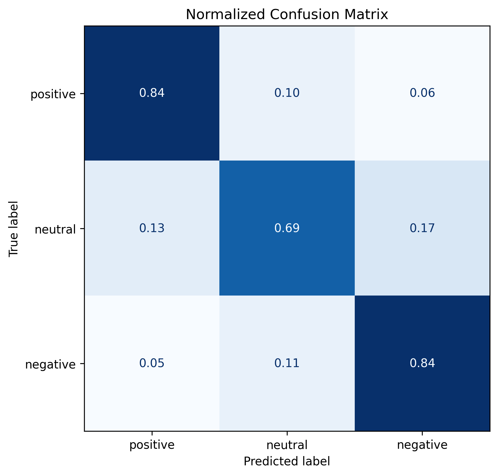

# 🌍 Distilbert Base Multilingual Cased Sentiment

本项目基于 `clapAI/MultiLingualSentiment` 数据集，使用蒸馏模型 `distilbert-base-multilingual-cased` 进行全量微调。

在处理 **315 万条** 全量多语言数据时，本项目通过优化的训练设置高效利用显存，仅需 **3.5 小时左右** 即可在单块 **NVIDIA A10** 上完成微调，并获得 **78.91** 的 Macro F1 分数；证明即使不使用顶级算力，也能快速迭代出工业级的多语言情感分析模型。得益于极低的显存占用，该方案甚至可在消费级 GPU（如 RTX 4060）上流畅运行。

------


## 🤗 模型开源

本项目微调后的模型权重已上传至 Hugging Face Model Hub，您可以直接调用：

👉 **[Yuu-Xie/distilbert-base-multilingual-cased-sentiment](https://huggingface.co/Yuu-Xie/distilbert-base-multilingual-cased-sentiment)**

---


## 📂 项目结构

```plaintext
├── configs/                    # 训练超参数配置 (JSON)
├── notebooks/                  # Jupyter Notebook 实验与可视化
├── scripts/
│   ├── train.py                # 高效全量训练脚本
│   ├── eval.py                 # 批量评估与指标生成脚本
│   └── app.py                  # 基于 Gradio 的交互式演示界面
├── requirements.txt            # Python 依赖包列表
└── README.md                   # 项目说明文档
```

---


## 📅 数据集概览 (Dataset)

项目使用 Hugging Face 开源的 [clapAI/MultiLingualSentiment](https://huggingface.co/datasets/clapAI/MultiLingualSentiment) 数据集。

- **📊 数据规模**：约 315 万条（全量训练）
- **🌍 支持语言**：英文、中文、日文等多语言
- **🏷 标签体系**：三分类（Positive, Neutral, Negative）
- **🧪 测试集规模**：393,436 条

------


## ⚡ 训练效率监控 (Performance Metrics)

本项目在训练阶段表现出了极高的吞吐量，能够有效支撑“快速迭代”和“低成本实验”的需求。

| **维度**       | **指标参数**             | **备注**                             |
| -------------- | ------------------------ | ------------------------------------ |
| **训练硬件**   | NVIDIA A10 (24GB)        | 中等算力企业级显卡                   |
| **总耗时**     | **3h 41m**               | 包含每 2500 步的验证开销             |
| **精度模式**   | `bf16` (Mixed Precision) | 相比 `fp16` 动态范围更大，训练更稳定 |
| **训练吞吐量** | **~6.5 it/s**            | Batch Size: 128                      |
| **评估吞吐量** | **~1.5 it/s**            | Batch Size: 256                      |
| **显存占用**   | 5765 MiB (Training)      | 约占 A10 总显存的 25%                |

------


## 📊 评估结果 (Evaluation Results)

在完整测试集（393,436 samples）上的最终表现如下：

### 1. 分类报告

| **类别 (Class)** | **精确率 (Precision)** | **召回率 (Recall)** | **F1-score** | **样本量 (Support)** |
| ---------------- | ---------------------- | ------------------- | ------------ | -------------------- |
| **Positive**     | 0.8500                 | 0.8386              | **0.8443**   | 145,630              |
| **Neutral**      | 0.7001                 | 0.6923              | **0.6961**   | 104,152              |
| **Negative**     | 0.8183                 | 0.8359              | **0.8270**   | 143,654              |

### 2. 综合指标

| **指标**         | **精确率** | **召回率** | **F1-score** |
| ---------------- | ---------- | ---------- | ------------ |
| **Macro Avg**    | 0.7894     | 0.7890     | **0.7892**   |
| **Weighted Avg** | 0.7987     | 0.7989     | **0.7988**   |

**Overall Accuracy**: 0.7989

### 3. 混淆矩阵



------


## ⚖️ 基线对比 (Benchmark Comparison)

为了评估性价比，我们将本项目与 `clapAI` 官方提供的重型基线模型进行了对比：

| **模型名称**                                     | **模型底座**           | **参数量** | **F1-score** |
| ------------------------------------------------ | ---------------------- | ---------- | ------------ |
| **distilbert-base-multilingual-cased-sentiment** | **DistilBERT-m-cased** | **134M**   | **78.91**    |
| modernBERT-base-multilingual-sentiment           | ModernBERT-base        | 150M       | 80.16        |
| modernBERT-large-multilingual-sentiment          | ModernBERT-large       | 396M       | 81.40        |
| roberta-base-multilingual-sentiment              | XLM-RoBERTa-base       | 278M       | 81.80        |
| roberta-large-multilingual-sentiment             | XLM-RoBERTa-large      | 560M       | 82.60        |

------


## 🚀 快速开始 (How to Start)

### 1. 安装环境

```bash
git clone https://github.com/Yuu-Xie/distilbert-base-multilingual-cased-sentiment.git
cd distilbert-base-multilingual-cased-sentiment
pip install -r requirements.txt
```

### 2. 快速推理

直接从 Hugging Face 加载模型进行情感预测：

```python
from transformers import pipeline

# 自动从 Hugging Face 加载权重
classifier = pipeline(
    task="sentiment-analysis", 
    model="Yuu-Xie/distilbert-base-multilingual-cased-sentiment",
    device=0  # 如果有 GPU 请设为 0
)

texts = [
    "A good environment with good food. Price is reasonable.",
    "这个产品质量很一般，不建议购买。"
]
predictions = classifier(texts)
print(predictions)
```

### 3. 运行本地 Web 演示

使用 Gradio 启动交互式界面：

```python
python scripts/app.py
```

### 4. 训练与评估

如果您需要重新训练或在自己的数据集上验证：

```bash
# 开始训练
python scripts/train.py

# 运行全量评估报告
python scripts/eval.py
```

---


## 💡 为什么选择 DistilBERT ？

虽然 ModernBERT 或 XLM-RoBERTa 在绝对精度上略高，但本项目选择 DistilBERT 的核心考量是：

1. **极速迭代**：在 A10 上仅需 3.5 小时即可处理完 300 万条数据，意味着你可以快速进行数据清洗和实验。
2. **低部署门槛**：134M 的模型体积配合低显存占用，适合移动端或低配云服务器部署。

------

